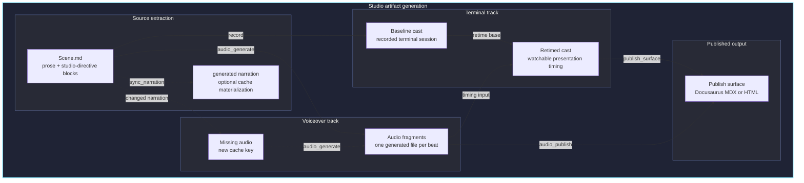

# Arbiter Media Studio

This directory is the source workspace for Arbiter documentation media. The
website is the cinema: it publishes finished casts, images, audio, transcripts,
and embeds. This directory is the studio: it owns the scripts, plans, tooling,
and repeatable production workflow that generate those finished assets.

## Vision

Arbiter media should make operator workflows feel concrete without replacing
copyable docs. Each recording should start from a written "movie script" that
captures what to show, what to say, where to pause, and what the viewer should
notice. Generated artifacts such as asciinema casts, rendered images, audio
tracks, captions, and transcripts should be outputs from that script, not the
source of truth.

The studio vocabulary is:

- scene: a complete recording or a large chapter, such as "Install Arbiter
  Server"
- beat: one uninterrupted narrated unit inside a scene
- action: visible terminal work inside a beat
- guide: an optional follow-along checkpoint for the viewer
- setup: hidden preparation work before the visible scene starts
- cleanup: hidden teardown work that runs when the scene exits, including after
  failures
- segment: generated audio or timing data derived from a beat

The durable source should describe separate tracks:

- terminal actions: commands, expected output events, waits, and cleanup
- narration: spoken text suitable for AI TTS generation
- captions: concise on-screen explanation for silent playback
- markers: chapter and sync points for the asciinema player
- render settings: terminal size, theme, font, and final-frame holds
- event gates: observable conditions that say when a beat is actually done

This keeps recordings reproducible across new versions while leaving room for
better presentation. A recording can start as a silent terminal cast, then later
gain captions, marker-aware overlays, an audio track, or static renders without
rewriting the story.

## Version and Timing Model

Movie scripts are allowed to change between Arbiter versions. New releases can
change command output, installation duration, prompts, defaults, or even the
best sequence to show. Treat the script as release-maintained source, not as a
timeless fixture.

Prefer event-based timing for real work:

- wait for a command to exit successfully
- wait for expected text or a regex in output
- wait for a prompt to return
- wait for a server URL to become reachable
- wait for a package install to finish
- wait for a file to exist or for generated config to contain an expected key

Use fixed sleeps only for viewer pacing: a short pause before narration, a
brief hold on important output, or the final frame. If a beat depends on a
network install, PyPI resolution, local server startup, or any command whose
duration can drift, the script should name the event that completes the beat
instead of relying on a fixed number of seconds.

A future recording runner should record both:

- the script's intended beats and event gates
- the observed timings from the current version's rehearsal

That gives each release a way to regenerate media honestly while still making
timing changes reviewable.

If a future pipeline rewrites cast timing, preserve real command execution and
output timing by default. Presentation timing, such as typed command pacing,
caption timing, and viewer holds, can be adjusted for readability. Runtime
timing from installs, config checks, server startup, and client calls is
observed product behavior. Compress or normalize it only as an explicit,
reviewable editorial choice. For example, a visible `sleep 10` command must
occupy ten seconds in every rendered output unless the recording config explicitly
marks that interval as presentation-compressed.

## Technical Production Spec

Each recording script should name the technical choices that affect whether the
result is reproducible and pleasant to watch.

### Tools

Use the current asciinema CLI from the upstream repository for studio
recordings. Distro packages can lag on the older 2.x CLI, so do not treat them
as the release-media baseline.

Install asciinema from source with Cargo:

```bash
cargo install --locked --git https://github.com/asciinema/asciinema
```

Verify the recorder before regenerating media:

```bash
asciinema --version
```

The `studio` frontend composes a Hydra config from `media/conf/` and is the
single entry point for normal recording work:

```bash
media/tools/studio recording=install-and-bootstrap
media/tools/studio recording=install-and-bootstrap action=check
media/tools/studio recording=install-and-bootstrap action=build
media/tools/studio recording=install-and-bootstrap action=build dry_run=true
media/tools/studio recording=install-and-bootstrap step=record +script_params.arbiter_source=0.9.2.dev1
media/tools/studio recording=install-and-bootstrap step=record +script_params.arbiter_source=local
```

`action=build` runs the normal end-to-end production chain: `record`,
`audio_generate`, `audio_publish`, `retime`, and publish the selected surface.
Use `dry_run=true` to print the Makefile-style build graph and concrete
inputs/outputs without running recording, TTS, publishing, or retiming.
Individual steps are available through the same frontend for iteration and
postmortem work.

Recording scripts can declare hidden setup and cleanup directives in
`studio-directive` blocks. Setup prepares per-scene resources such as operator
environments or local services. Cleanup tears down resources owned by that
scene, such as Docker staging deployments, even when the visible recording
fails. Cleanup output is captured in the run directory for postmortem
inspection instead of being shown in the cast.

The recording config declares publish surfaces. The default surface is what
plain `action=build` produces; override it with `surface=<name>` when you want
another output:

```yaml
publish:
  default: docusaurus
  surfaces:
    docusaurus:
      type: docusaurus_mdx
      file: website/docs/media/terminal-recordings.mdx
      placeholder: install-and-bootstrap
      component: TerminalCast
      intro_segment: overview

    plain_html:
      type: plain_html
      file: website/static/media/terminal-recordings.html
      placeholder: install-and-bootstrap
      intro_segment: overview

    standalone_html:
      type: standalone_html
      file: website/static/casts/install-and-bootstrap.html
      intro_segment: overview
```

Holder-based surfaces replace only the marked region and leave the rest of the
target file human-owned:

```md
<!-- studio:install-and-bootstrap:start -->
generated embed goes here
<!-- studio:install-and-bootstrap:end -->
```

Supported surface types:

- `docusaurus_mdx`: replaces a holder in a Docusaurus `.md` or `.mdx` page
  with a Docusaurus component, currently `TerminalCast`.
- `plain_html`: replaces a holder in an HTML page with an iframe fragment
  pointing at the static cast player.
- `standalone_html`: writes a disposable full HTML example page.

Artifact generation follows this state machine:



Editing `studio-directive` blocks in `Scene.md` updates the source consumed by
recording and audio generation. `step=sync_narration` is available when you
want a generated data snapshot for inspection, but the normal build path reads
the Markdown script directly.

Hydra creates a per-job output directory from `hydra.run.dir`. Jobs that
produce or preserve a terminal recording use `media/runs/<scene>/<run-id>/`.
Helper jobs such as `inspect`, `output`, `play`, `runs`, `check`, and build dry
runs use `media/studio-runs/<action>/<scene>/<run-id>/` so they do not pollute
the preserved recording history. The recorder uses the real recording output
directory for per-run operator workspace, mail-lab state, logs, and
intermediate files. Finished casts and timeline sidecars are swapped into the
website output path only after the recording completes successfully.

Each run also writes an executable postmortem entrypoint in the run directory:

```bash
media/runs/install-and-bootstrap/<run-id>/enter
```

Use the recorder's inspect action after a recording to open an interactive
subshell in the operator workspace with the recording's operator virtualenv
activated:

```bash
media/tools/studio recording=install-and-bootstrap action=inspect run_id=<run-id>
```

For PyPI-backed recordings, the operator virtualenv is cached under
`media/cache/operator-venvs/` by resolved package requirement and Python
version. A run keeps a small `operator-venv` symlink for postmortem shells
instead of storing a fresh copy of the installed environment every time.

List the latest preserved recording jobs with their scene id, age, result,
successful cast length, or failure reason. The default is the latest 10
completed jobs; override by count, by age, or both:

```bash
media/tools/studio action=runs
media/tools/studio recording=install-and-bootstrap action=runs
media/tools/studio action=runs runs_limit=25
media/tools/studio action=runs runs_since=30m
```

Use the play action without a run id to replay the newest preserved run cast
across all recordings:

```bash
media/tools/studio action=play
```

Pass a run id to replay a specific preserved run cast. The recording id is
deduced from the run id unless the run id is ambiguous across recordings:

```bash
media/tools/studio action=play run_id=<run-id>
```

Pass an explicit recording id without a run id to play the newest preserved
run cast for that scene:

```bash
media/tools/studio recording=install-and-bootstrap action=play
```

Use the output action to review the captured failure output. It opens a pager in
an interactive terminal and streams the output otherwise:

```bash
media/tools/studio recording=install-and-bootstrap action=output run_id=<run-id>
```

The recorder produces the baseline cast and a `.timeline.jsonl` sidecar. For
release media, prefer a fast baseline capture and then generate the watchable
presentation timing as a separate step:

```bash
media/tools/studio recording=install-and-bootstrap step=retime_check
media/tools/studio recording=install-and-bootstrap step=retime
```

The retimer uses visible timeline markers to synthesize command typing, insert
short pauses after Enter and command output, and restore recording viewer holds.
When published audio metadata exists, the retimer also uses narration segment
durations as minimum beat durations. A narration timing change can therefore be
handled by regenerating audio and rerunning retime, without rerecording the
terminal workflow.

Run the recorder with the Python environment that should drive the recording.
The session prepends that Python's `bin` directory to `PATH`, so a dedicated
recording virtualenv can own the installed Arbiter commands without falling back
to a developer checkout `.venv`.

The runner expects `hydra-core` in the recording Python environment. Recording
configs are trusted studio automation: action and check commands run as shell
snippets. Review configs before running them, and do not execute configs from
untrusted sources.

The alignment proof-of-concept compares a finished cast back to its config by
matching visible captions and command lines:

```bash
media/tools/studio recording=install-and-bootstrap step=align
```

Treat alignment as a review gate. If the command reports misalignment, stop and
review whether the base recording should be refreshed, the recording config
should be updated, or the movie script no longer matches the current major
version workflow. Use `allow_mismatch=true` only for exploratory
inspection, not for release readiness.

Recording beats can also include off-camera `checks`. Actions tell the visible
story; checks assert that the workflow still satisfies hidden expectations. A
successful check prints nothing into the recording. A failed check stops the
recording, prints stderr only, and points at `action=inspect`, `action=play`,
and `action=output` commands for postmortem review. Successful checks write
start and end events to a `.timeline.jsonl` sidecar, and the recorder subtracts
those check intervals from the baseline cast so off-camera assertions do not add
dead air to the viewer timeline. If visible terminal output occurs during a
hidden-check interval, the recorder fails instead of shipping a cast that
silently hides a timing or logging problem.

Recording configs can also include a top-level `setup` list. Setup runs
before the first visible beat, uses the same hidden timeline handling as
checks, and can prepare per-recording state such as a temporary operator
workspace or local service fixtures. Keep viewer-facing workflow steps as
actions; use setup only for studio scaffolding that should not appear in the
movie. Setup can call `recording_write_postmortem_entrypoint "$workspace"
"$venv"` after it creates a recording-specific workspace and virtualenv.

Base recordings preserve terminal event timing by default. A config can set
`capture.baseline_compressed: true` to skip synthetic typing and viewer holds
during capture, while still preserving real command runtime. Do not set
`capture.idle_time_limit` unless the recording intentionally asks asciinema
players or renderers to cap long idle gaps as an editorial choice.

Before writing a cast into the website tree, the recorder normalizes public cast
metadata so local checkout paths and shell names do not ship in the asciinema
header.

The Markdown movie script is the authoring source of truth for narration.
Machine-readable script fields must live inside fenced `studio-directive` YAML
blocks. Everything outside those blocks is human prose. The blocks may be split
for readability, or combined into one larger directive block; the tooling treats
them as one logical directive stream.

Each narrated beat must include a stable beat id, heading, and narration:

````markdown
### Bootstrap Docker Staging Directory

```studio-directive
beat:
  id: init-staging
  heading: Bootstrap Docker Staging Directory
  narration: >-
    Start by bootstrapping a Docker staging directory.
```
````

The audio tools read narration directly from the Markdown script. To materialize
the extracted narration as generated data for review, run:

```bash
media/tools/studio recording=install-and-bootstrap step=sync_narration
```

The generated file lives under `media/generated/narration/`. It is a cache of
data derived from the Markdown script, not a Hydra config source. Do not edit
generated narration YAML by hand; edit the Markdown script and rerun the sync
action when you want the generated view refreshed.

The audio generator combines script narration with the recording's `audio`
settings and writes cached TTS segments:

```bash
media/tools/studio recording=install-and-bootstrap step=audio_check
media/tools/studio recording=install-and-bootstrap step=audio_dry_run
media/tools/studio recording=install-and-bootstrap step=audio_generate
media/tools/studio recording=install-and-bootstrap step=audio_publish
```

Use `step=audio_check` to validate script narration, source-script hash, and
config without contacting the TTS provider. Use `step=audio_dry_run` to see a
human-readable summary of cached, reusable, and missing voiceover segments. Add
`output_format=json` only when a script needs the machine-readable plan.

By default, Studio loads repo-root `.env` before running actions and does not
override variables already present in the shell. Disable this with
`load_env_file=false`, choose a different file with `env_file=path/to/.env`, or
allow the file to replace existing values with `env_override=true`. Audio
generation requires the environment variable named by the recording config, for
example `OPENAI_ARBITER_CINEMA_AUDIO_API_KEY`.

To also request transcription timestamps for generated audio, use:

```bash
media/tools/studio recording=install-and-bootstrap step=audio_generate timestamps=true
```

The timestamp step writes `*.timeline.json` sidecars next to the cached audio
segments. It uses the recording config's `audio.transcription` settings.

Audio segment cache files are written under `media/cache/audio/` by default and
are ignored by git. Cache keys include the normalized narration text plus the
provider, model, voice, format, and generation instructions so unchanged
segments can be reused across script edits.

For quick sentence-boundary experiments, the studio includes a small demo that
generates one chained narration file, transcribes it, derives sentence spans,
and writes per-sentence clips:

```bash
.venv/bin/python media/tools/sentence_timing_demo.py
```

Rendered GIF or image outputs are not part of the first media baseline. If a
later website or distribution path needs static renders, choose and document a
renderer then. `agg` is one candidate, but the initial studio workflow should
not depend on it.

If `agg` is selected for static rendering later, install it from source with
Cargo:

```bash
cargo install --git https://github.com/asciinema/agg
```

### Video Parameters

Record terminal dimensions explicitly. Use terminal columns and rows as the
primary source because asciinema records terminal sessions, not pixels. Rendered
pixel dimensions then follow from the renderer's font size, line height, and
padding.

Suggested starting point:

- terminal size: 100 columns by 28 rows
- renderer font size: 16px
- line height: 1.35 to 1.45
- final-frame hold: 3 to 5 seconds

If the website embed needs a fixed aspect ratio, decide that at the render or
player layer rather than changing command output to fit an arbitrary pixel
target.

### TTS Credentials

AI TTS generation should read provider credentials from the environment, never
from committed files. Scripts should name the expected variable, such as
`OPENAI_ARBITER_CINEMA_AUDIO_API_KEY`, and fail clearly when narration
generation is requested without it.

Keep TTS inputs committed as text. Generated audio may be committed only when it
is intended to ship with the website. If narration is generated in segments,
cache by beat narration text so minor script edits do not require regenerating
unchanged audio.

Cache generated audio by a stable hash of the normalized audio script segment
and the generation settings that affect sound, such as provider, model, voice,
format, speed, and pronunciation instructions. Changing narration text should
regenerate only the affected segments. Changing the voice or model should
invalidate the matching cached segments.

The cache can stay outside the website output tree. The deploy step should copy
or assemble only the audio files that are meant to ship.

### Color Scheme

Use a documented terminal color scheme for each recording. Prefer one stable
theme across the Arbiter docs unless a particular demo needs contrast changes.

The recording should avoid relying on the recorder's local terminal theme when
the output is meant to be reproducible. A future static renderer can use a
fixed theme, and a future website player embed can pass the matching asciinema
player theme.

The script should also avoid color-only meaning. Captions, narration, and
terminal output should remain understandable in monochrome or high-contrast
contexts.

### Per-Recording Environment

Shared studio tooling should stay minimal: the recorder, optional renderers, and
the runner itself. Everything else belongs to the individual recording.

Each recording script should declare its own environment setup. A bootstrap
recording may need only a temporary config directory. A live-operation recording
may need a fresh Python environment, local SMTP and IMAP servers, fake
credentials, seeded messages, and an Arbiter server process.

Recordings that show Arbiter talking to services should use local disposable
services, not external personal accounts. The per-recording setup should be
explicit about:

- which local services are started
- which ports are selected and how conflicts are avoided
- whether the recording uses the repo virtualenv, a fresh venv, a built
  wheelhouse, or installed PyPI packages
- which generated values are applied invisibly after visible bootstrap steps,
  such as filling local test credentials into a freshly bootstrapped `.env`
  file
- which test or demo dependencies are installed
- where temporary config, data, and env files live
- which secrets are fake and where they are injected
- how readiness is detected
- how cleanup runs after recording

Any per-recording service setup should be event-gated. For example, wait for a
socket to accept connections or for a health command to pass instead of sleeping
for a fixed number of seconds.

### Orchestration

Nox can orchestrate the studio pipeline without owning the interactive recording
details. The recorder should still be the component that controls asciinema,
terminal geometry, prompts, markers, event gates, and output paths.

The intended sequence is:

1. Set up the per-recording environment.
2. Call the recorder to produce or refresh the baseline `.cast` file and
   timeline.
3. Generate the retimed presentation cast.
4. Generate optional audio, captions, transcripts, or other derived tracks.
5. Deploy or copy finished assets into the website tree.
6. Run website checks that prove the media is referenced and buildable.

This lets Nox provide the release-friendly command surface while keeping the
terminal session itself predictable and easy to debug.

## Studio Layout

```text
media/
  README.md                 # studio vision and workflow
  conf/                     # Hydra config defaults
  recording-scripts/        # human movie scripts and shot lists
  tools/                    # local studio runners and generators
```

Hydra job directories under `media/runs/` and `media/studio-runs/` are scratch
space, not published assets. `media/runs/` is reserved for preserved recording
jobs; `media/studio-runs/` is for helper invocations that should not appear in
the recording job list. Future tooling can add directories for generated
command files, TTS inputs, caption manifests, or render manifests. Finished
website assets should still land under `website/static/`, and published
documentation should still live under `website/docs/`.

## Initial Production

The initial release should include one focused video:

**Install and bootstrap Arbiter**

Purpose: show a new operator the shortest safe path from installed commands to
a disposable working config.

The first script lives at `media/recording-scripts/install-and-bootstrap.md`.

## Production Principles

- Keep the movie script as the source of truth.
- Review scripts during release readiness; update them when the current version
  changes output, timing, or the recommended flow.
- Prefer event gates over fixed sleeps for work whose duration can vary.
- Use disposable config directories only.
- Do not record `config.local/`, real home config, or real secrets.
- Prefer repo-local `.venv/bin` commands during release rehearsals.
- Generate shipping recordings from the intended clean release environment so
  visible version output does not accidentally show a dirty source checkout.
- Keep videos short enough to watch inline in docs.
- Keep nearby copyable commands for users and agents who do not watch media.
- Commit regenerated source text and scripts; commit generated media only when
  it is intended to ship with the website.

## Output Targets

The first useful artifact is an asciinema `.cast` file under
`website/static/casts/`, embedded with the asciinema web player. Treat a fast
baseline cast as production input; the watchable website artifact should be the
retimed presentation cast once the retime step is part of the release flow.

Static renders can live under `website/static/img/casts/` later if a renderer
is selected.

If narration is added, store generated audio and transcripts under a future
static media path such as `website/static/audio/casts/`. The text script should
remain committed so audio can be regenerated when wording or versions change.
