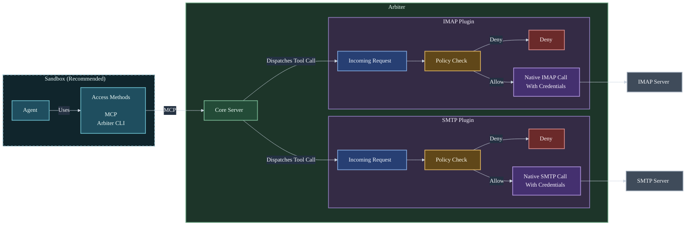

Arbiter provides policy-controlled access to configured services for
agents. Today it exposes that access through MCP and a client CLI; additional
interfaces may be added later.

It gives agents a small surface for discovering what they are allowed to do,
choosing an authorized context, and running one operation with deployment-owned
configuration and policy.

## The shape

- The core server composes config, loads plugins, exposes MCP and CLI access
  surfaces, and enforces the shared discovery flow.
- Operators configure accounts, credentials, service activation, and policies.
- Agents discover capabilities before selecting operations.
- Service plugins own their schemas, bootstrap templates, policy checks, and
  runtime behavior.

## Current capabilities

- SMTP service plugin.
- IMAP service plugin.

## Where to start

- New operator: start with [Quickstart](get-started/quickstart.md).
- Agent/tool user: start with [Arbiter CLI Reference](use/cli-reference.md).
- Plugin author: start with [Writing Plugins](extend/plugins.md).
